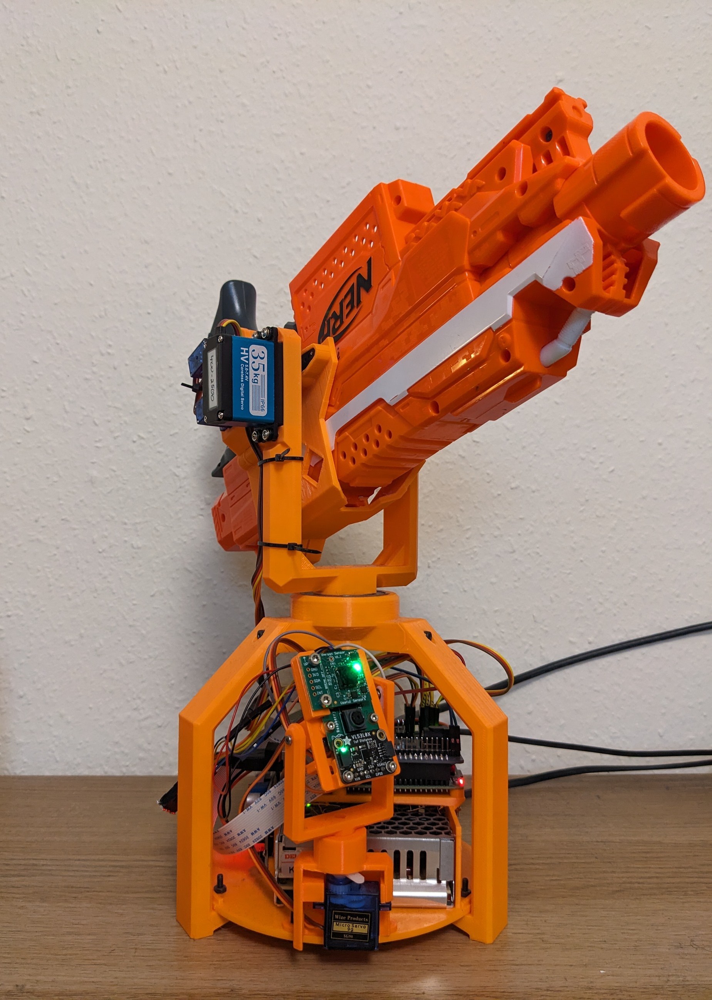

# Automatic NERF Turret



#### What's the idea?
To make an automated turret that can do these things:
* Automatically target at least anyone, ideally everyone but me
* Use an unmodified NERF Strife for the shooting, extra points if it's quick-release
* Account for distance real-time by aiming upwards
* 3D print most f not all of the body pieces and brackets

Extra points for me if I add anything else, this is a continuous project.

I've seen a few NERF turrets over the years, but they usually have the sensors mounted to the barrel which limits their actions, I thought it would be cool to not do that.

## CAD & Code
Both the individual 3d files and an Assembled .STEP file are provided for printing or modification.
Included in the .STEP are models for components like the servos and RPi, some are basic models I made myself while others I sourced online for reference. I have included an [External models](#extModels) section below for crediting and linking to any sources. 


### External models <a id='extModels'></a>
* [SG90 - Micro Servo 9g - Tower Pro](https://grabcad.com/library/sg90-micro-servo-9g-tower-pro-1) (Modified - I increased the height to match my servos)
* [Raspberry Pi Camera Module v2.1](https://grabcad.com/library/raspberry-pi-camera-4) (Modified - Added ribbon cable)
* [Raspberry Pi 4 model B](https://grabcad.com/library/raspberry-pi-4-model-b-1)
* [TF-Luna LiDAR](https://grabcad.com/library/benewake-tf-luna-1)
* [VTX-212-035-0xx](https://grabcad.com/library/vtx-212-035-0xx-1) Not the same power supply but it matches the measurments so I used it for the designs.

### Components used
* TF-Luna LiDAR Module
* Person Sensor by Useful Sensors
* Raspberry Pi Camera Module v2.1
* 2 x DS3235SG 35Kg 270° Servos
* 4 x SG90 9g Servos
* Raspberry Pi 4 Model B ( prev. a Pi2 Model B)
* Adafruit 16-Channel PWM / Servo HAT for Raspberry Pi
* Mini DC 12v-5v 10A power converter
* 6005 25x47x12mm bearing
* 12v Switching Power Supply
* A variety of M2, M3, and M4 bolts & nuts
* NERF Stryfe blaster

### Dependencies
```python
sudo apt install -y python3-picamera2
pip install -r requirements.txt
```
* [Adafruit_CircuitPython_VL53L0X](https://github.com/adafruit/Adafruit_CircuitPython_VL53L0X)
* [Adafruit_CircuitPython_ServoKit](https://github.com/adafruit/Adafruit_CircuitPython_ServoKit)
* [TF-Luna i2C Driver](https://github.com/ideocentric/tflunai2c)

## My reasoning's for certain decisions

#### Buying components vs. using what I have
My decisions about where to put money in this project seems confusing:
* I'm basing the build around an old NERF blaster without modifying it
* Originally a Raspberry Pi 2b was used which couldn't handle facial detection at speed so the PersonSensor was used
* A Raspberry Pi 4 is used after the 2b retired so some basic facial detection can be done there
* I bought high torque 35kg servos because if I'm spending money I'm making sure I can use them for other stuff.

#### What's with the massive bearing?
The 6005 bearing is both overkill for the weight of a plastic NERF blaster, and the direction of forces on the bearing. My main reasons for using it is that it's centre diameter is nice and big, and it's significantly smoother than bare plastic.