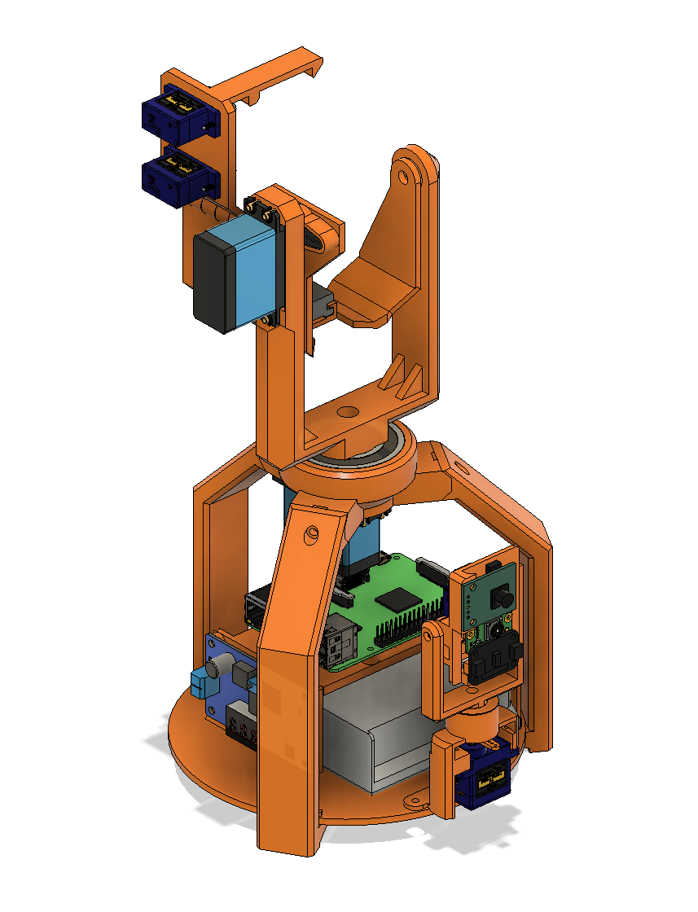

# Automatic NERF Turret

This is a personal side-project to build an automated nerf turret I mainly wanted to make it because I've seen other nerf turrets that mount the sensors/cameras to the gun, but that means it can't aim higher to account for distance. This turret allows the sensors to move independently of the barrel and includes a LIDAR to measure the distance.

## My reasoning's for certain decisions

### Buying components vs. using what I have
My decisions about where to put money in this project seems confusing. I'm basing the build around an old nerf gun without modifying it and I've limited my computing power to a Raspberry Pi 2, but I also bought a Person Sensor to do facial detection and high torque 35kg servos. The simple answer is I have a lot of random little things, like a Raspberry Pi 2, and I try to do workarounds with what I have first before buying something else; it's cheaper & easier to buy a Person Sensor and use an old RPi than it is to try and get a new one have you seen the prices?!

##

### Components
* 2 x DS3235SG 35Kg 270° Servos
* 4 x 9g Servos
* Raspberry Pi 2 Model B
* 

### Dependencies
* [Adafruit_CircuitPython_VL53L0X](https://github.com/adafruit/Adafruit_CircuitPython_VL53L0X)
* [Adafruit_CircuitPython_ServoKit](https://github.com/adafruit/Adafruit_CircuitPython_ServoKit)
